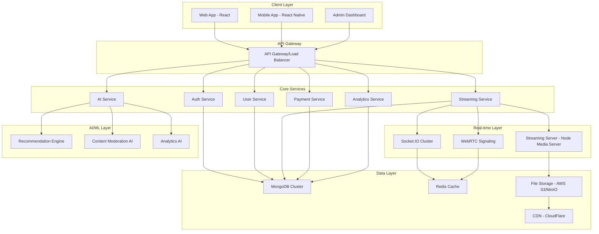

# Design Document

## Overview

This design document outlines the technical architecture for transforming NOVASTREAM into an advanced live streaming platform with AI-powered features, comprehensive monetization, and enterprise-grade analytics. The solution builds upon the existing Node.js/React architecture while introducing microservices for scalability and real-time capabilities.

## Architecture

### High-Level Architecture



### Technology Stack Enhancement

**Backend Services:**
- Node.js with Express.js (existing)
- Socket.IO for real-time communication (existing, enhanced)
- Node Media Server for RTMP/WebRTC streaming
- TensorFlow.js for AI/ML capabilities
- Stripe/PayPal SDK for payments
- Redis for caching and session management
- MongoDB for primary data storage (enhanced from JSON)

**Frontend Enhancements:**
- React 18 with Concurrent Features
- WebRTC for peer-to-peer streaming
- Chart.js/D3.js for analytics visualization
- Framer Motion for advanced animations
- React Query for state management and caching

**Infrastructure:**
- Docker containers for microservices
- Kubernetes for orchestration (production)
- CloudFlare for CDN and DDoS protection
- AWS S3/MinIO for file storage
- Prometheus + Grafana for monitoring

## Components and Interfaces

### 1. Live Streaming Service

**Core Components:**
```javascript
// Streaming Service Architecture
class StreamingService {
  constructor() {
    this.mediaServer = new NodeMediaServer(config);
    this.webrtcSignaling = new WebRTCSignaling();
    this.streamManager = new StreamManager();
  }
  
  async startStream(creatorId, streamConfig) {
    // Initialize RTMP endpoint
    // Setup WebRTC signaling
    // Configure stream quality options
    // Enable real-time analytics
  }
  
  async handleViewerConnection(streamId, viewerId) {
    // Authenticate viewer
    // Check stream capacity
    // Establish WebRTC connection
    // Track viewer metrics
  }
}
```

**API Endpoints:**
- `POST /api/streams/start` - Initialize live stream
- `GET /api/streams/live` - Get active streams
- `POST /api/streams/:id/join` - Join stream as viewer
- `PUT /api/streams/:id/settings` - Update stream settings
- `DELETE /api/streams/:id/end` - End live stream

### 2. AI Recommendation Engine

**Machine Learning Pipeline:**
```javascript
class RecommendationEngine {
  constructor() {
    this.model = new TensorFlowModel();
    this.userBehaviorTracker = new BehaviorTracker();
    this.contentAnalyzer = new ContentAnalyzer();
  }
  
  async generateRecommendations(userId) {
    const userProfile = await this.getUserProfile(userId);
    const contentFeatures = await this.getContentFeatures();
    const predictions = await this.model.predict(userProfile, contentFeatures);
    return this.rankRecommendations(predictions);
  }
  
  async updateModel(interactionData) {
    // Continuous learning from user interactions
    // Update recommendation weights
    // Retrain model periodically
  }
}
```

**Features:**
- Collaborative filtering for user similarity
- Content-based filtering for stream categorization
- Real-time behavior tracking
- A/B testing for recommendation algorithms

### 3. Content Moderation AI

**Moderation Pipeline:**
```javascript
class ContentModerationAI {
  constructor() {
    this.visionModel = new ComputerVisionModel();
    this.audioModel = new AudioAnalysisModel();
    this.textModel = new NLPModel();
  }
  
  async moderateStream(streamData) {
    const videoAnalysis = await this.visionModel.analyze(streamData.video);
    const audioAnalysis = await this.audioModel.analyze(streamData.audio);
    const chatAnalysis = await this.textModel.analyze(streamData.chat);
    
    return this.combineAnalysis([videoAnalysis, audioAnalysis, chatAnalysis]);
  }
  
  async handleViolation(violation) {
    // Automatic content flagging
    // Creator notification
    // Temporary stream suspension if severe
  }
}
```

### 4. Monetization System

**Payment Processing:**
```javascript
class MonetizationSystem {
  constructor() {
    this.stripeClient = new Stripe(process.env.STRIPE_SECRET);
    this.paypalClient = new PayPal(config);
    this.revenueCalculator = new RevenueCalculator();
  }
  
  async processDonation(donationData) {
    // Validate payment method
    // Process payment through Stripe/PayPal
    // Calculate platform fee (30%)
    // Queue creator payout (70%)
    // Send real-time notification
  }
  
  async handleSubscription(subscriptionData) {
    // Create recurring payment
    // Grant subscriber benefits
    // Update creator revenue metrics
  }
}
```

**Revenue Features:**
- Real-time donations with custom amounts
- Subscription tiers with exclusive content
- Virtual gifts and stickers
- Ad revenue sharing
- Sponsored content opportunities

### 5. Analytics Dashboard

**Real-time Metrics:**
```javascript
class AnalyticsDashboard {
  constructor() {
    this.metricsCollector = new MetricsCollector();
    this.dataProcessor = new DataProcessor();
    this.reportGenerator = new ReportGenerator();
  }
  
  async getRealtimeMetrics(streamId) {
    return {
      concurrentViewers: await this.getCurrentViewers(streamId),
      engagementRate: await this.calculateEngagement(streamId),
      revenueGenerated: await this.getStreamRevenue(streamId),
      chatActivity: await this.getChatMetrics(streamId)
    };
  }
  
  async generateCreatorReport(creatorId, timeRange) {
    // Aggregate performance data
    // Calculate growth metrics
    // Generate insights and recommendations
    // Export to multiple formats
  }
}
```

## Data Models

### Enhanced User Model
```javascript
const UserSchema = {
  _id: ObjectId,
  username: String,
  email: String,
  profile: {
    displayName: String,
    bio: String,
    avatar: String,
    banner: String,
    verified: Boolean,
    creatorStatus: {
      isCreator: Boolean,
      tier: String, // 'basic', 'premium', 'partner'
      monetizationEnabled: Boolean,
      totalEarnings: Number
    }
  },
  preferences: {
    theme: String,
    language: String,
    notifications: Object,
    privacy: Object
  },
  analytics: {
    totalViews: Number,
    totalFollowers: Number,
    engagementRate: Number,
    lastActive: Date
  },
  aiProfile: {
    interests: [String],
    behaviorVector: [Number],
    recommendationWeights: Object
  }
};
```

### Stream Model
```javascript
const StreamSchema = {
  _id: ObjectId,
  creatorId: ObjectId,
  title: String,
  description: String,
  category: String,
  tags: [String],
  status: String, // 'live', 'ended', 'scheduled'
  streamConfig: {
    quality: String,
    rtmpUrl: String,
    streamKey: String,
    maxViewers: Number
  },
  metrics: {
    currentViewers: Number,
    peakViewers: Number,
    totalViews: Number,
    duration: Number,
    engagementScore: Number
  },
  monetization: {
    donationsEnabled: Boolean,
    subscriptionOnly: Boolean,
    totalRevenue: Number,
    donations: [DonationSchema]
  },
  moderation: {
    aiFlags: [Object],
    manualReports: [Object],
    contentRating: String
  },
  createdAt: Date,
  endedAt: Date
};
```

### Analytics Model
```javascript
const AnalyticsSchema = {
  _id: ObjectId,
  entityType: String, // 'stream', 'user', 'platform'
  entityId: ObjectId,
  timestamp: Date,
  metrics: {
    viewers: Number,
    engagement: Number,
    revenue: Number,
    chatMessages: Number,
    reactions: Number
  },
  demographics: {
    countries: Object,
    ageGroups: Object,
    devices: Object
  },
  aiInsights: {
    contentScore: Number,
    recommendationImpact: Number,
    predictedGrowth: Number
  }
};
```

## Error Handling

### Streaming Error Recovery
```javascript
class StreamErrorHandler {
  async handleStreamFailure(streamId, error) {
    switch(error.type) {
      case 'NETWORK_INTERRUPTION':
        await this.attemptReconnection(streamId);
        break;
      case 'CAPACITY_EXCEEDED':
        await this.scaleStreamingInfrastructure();
        break;
      case 'CONTENT_VIOLATION':
        await this.suspendStreamWithNotification(streamId);
        break;
      default:
        await this.logErrorAndNotifyAdmins(error);
    }
  }
  
  async gracefulDegradation(streamId) {
    // Reduce stream quality automatically
    // Limit new viewer connections
    // Maintain core functionality
  }
}
```

### AI Model Fallbacks
- Backup recommendation algorithms when ML models fail
- Manual moderation queue when AI confidence is low
- Cached recommendations for service interruptions
- Progressive enhancement for AI features

## Testing Strategy

### Performance Testing
```javascript
// Load testing for concurrent streams
describe('Streaming Performance', () => {
  test('should handle 1000 concurrent viewers per stream', async () => {
    const stream = await createTestStream();
    const viewers = await simulateViewers(1000);
    
    expect(stream.latency).toBeLessThan(3000); // 3 seconds
    expect(stream.quality).toBeGreaterThan(0.95); // 95% quality
  });
});
```

### AI Model Testing
```javascript
// Recommendation accuracy testing
describe('AI Recommendations', () => {
  test('should achieve >80% recommendation relevance', async () => {
    const testUsers = await getTestUserProfiles();
    const recommendations = await generateRecommendations(testUsers);
    const accuracy = await measureRecommendationAccuracy(recommendations);
    
    expect(accuracy).toBeGreaterThan(0.8);
  });
});
```

### Integration Testing
- End-to-end streaming workflow tests
- Payment processing integration tests
- Real-time communication tests
- Cross-platform compatibility tests

### Security Testing
- Authentication and authorization tests
- Payment security validation
- Content moderation effectiveness
- Data privacy compliance tests

## Performance Optimization

### Streaming Optimization
- Adaptive bitrate streaming based on viewer connection
- CDN integration for global content delivery
- Edge server deployment for reduced latency
- Automatic quality scaling during high traffic

### Database Optimization
- MongoDB sharding for horizontal scaling
- Redis caching for frequently accessed data
- Connection pooling for database efficiency
- Automated backup and recovery systems

### AI Model Optimization
- Model quantization for faster inference
- Batch processing for recommendation updates
- GPU acceleration for computer vision tasks
- Distributed training for model improvements

This design provides a comprehensive foundation for transforming NOVASTREAM into a world-class streaming platform that can compete with major players while maintaining the existing codebase and gradually implementing advanced features.